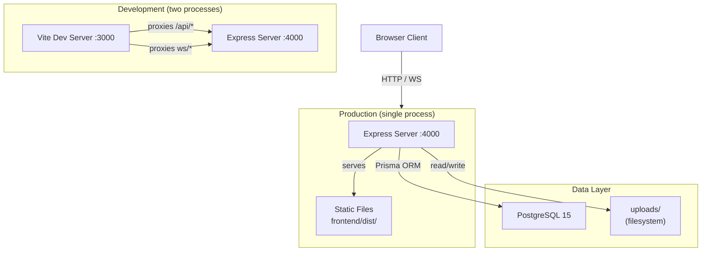
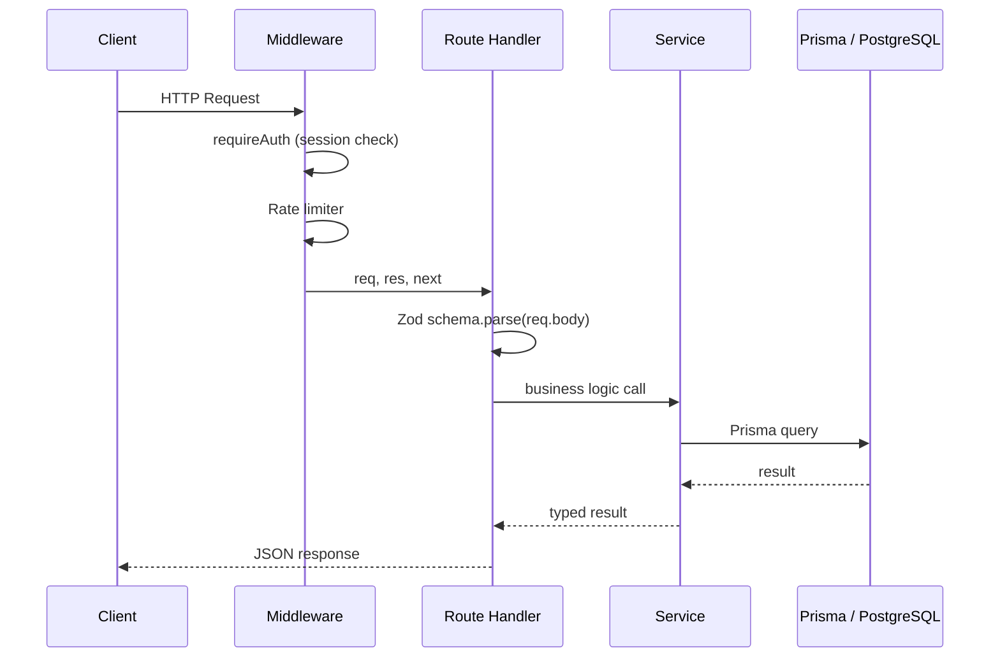
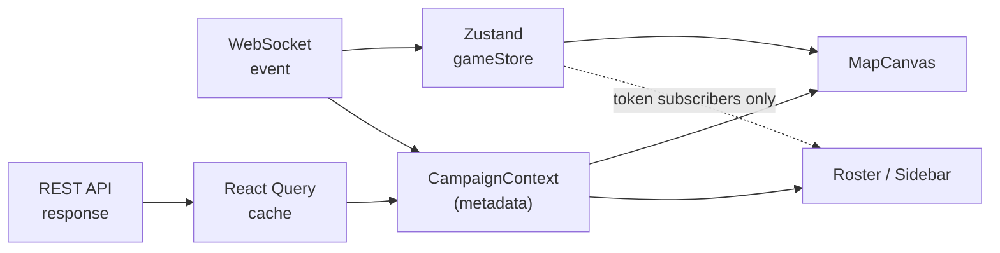
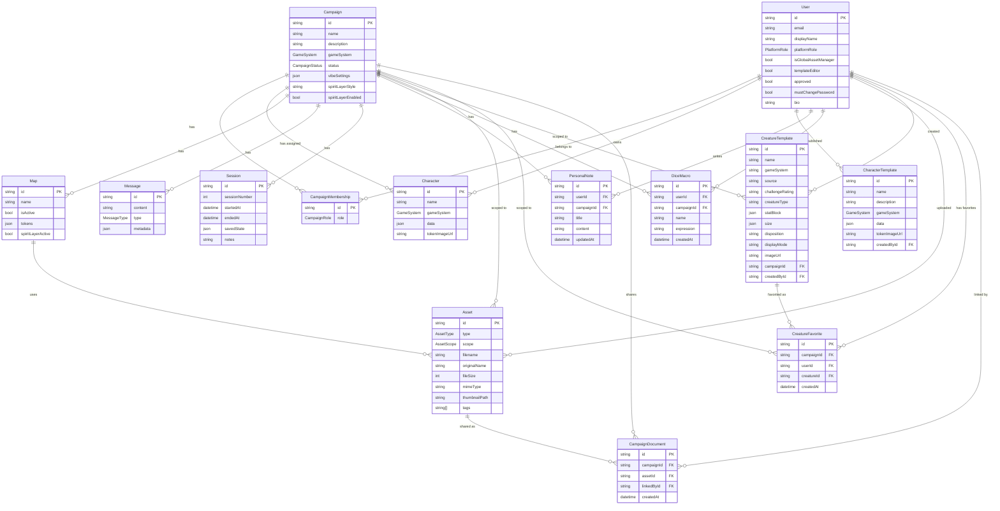
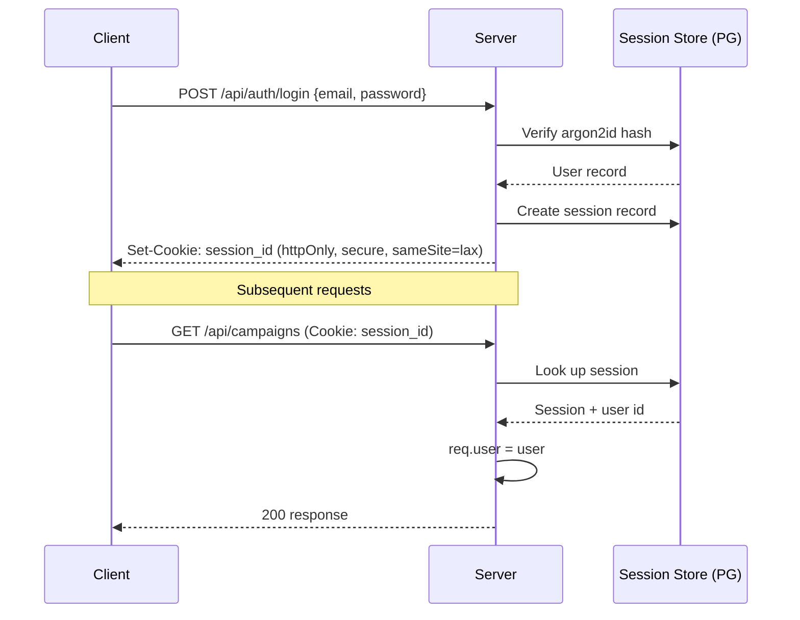
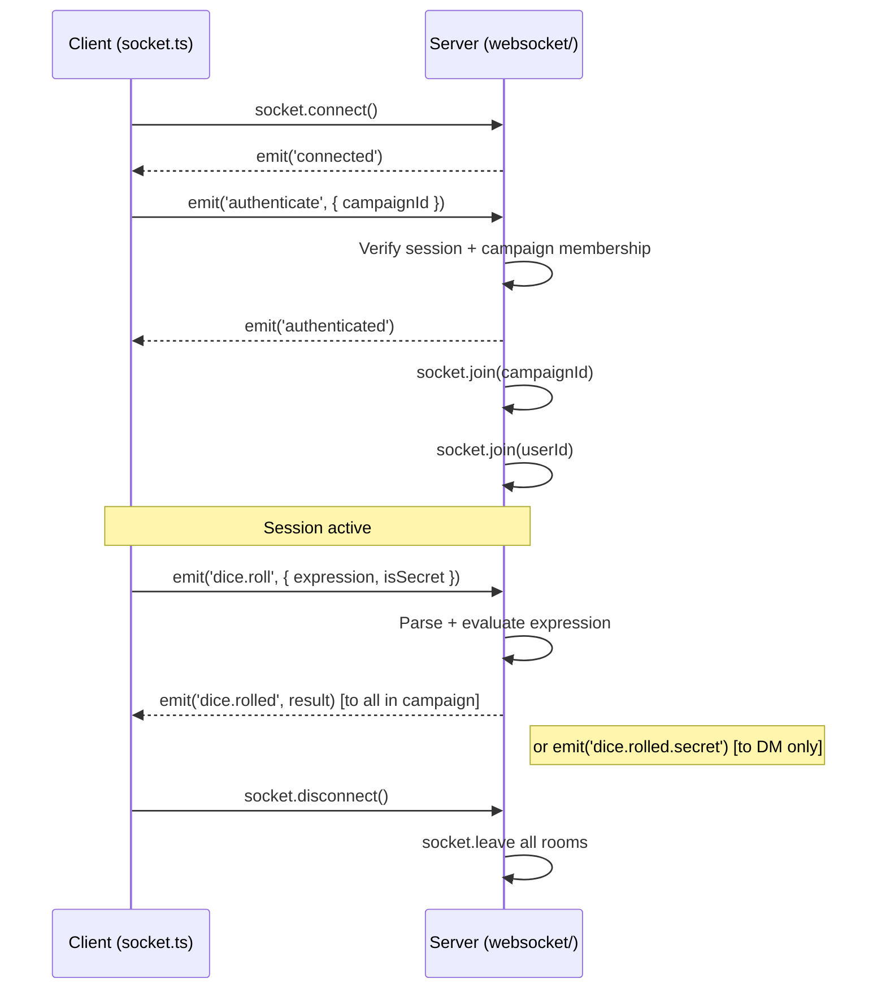

# CozyVTT — Architecture

This document describes the system architecture, data models, and key design decisions in CozyVTT.

---

## Table of Contents

1. [High-Level Overview](#high-level-overview)
2. [Backend Architecture](#backend-architecture)
3. [Frontend Architecture](#frontend-architecture)
4. [Database Schema](#database-schema)
5. [Authentication & Authorization](#authentication--authorization)
6. [WebSocket Architecture](#websocket-architecture)
7. [File Storage](#file-storage)
8. [Game Systems Architecture](#game-systems-architecture)
9. [Key Design Decisions](#key-design-decisions)

---

## High-Level Overview

CozyVTT is a monorepo containing a Node.js/Express API backend and a React SPA frontend. In production, the backend serves both the REST API and the built frontend static files. In development, a Vite dev server runs separately and proxies API/WebSocket traffic to the backend.



---

## Backend Architecture

### Layer Structure

```
src/
├── server.ts          Entry point — creates Express app, attaches Socket.io
├── config/            Configuration loading (env vars, validation)
├── middleware/
│   ├── auth.ts        Passport.js session middleware, requireAuth guards
│   ├── passwordChange.ts  Gates every route until an admin-issued password is replaced
│   ├── rateLimit.ts   Per-route rate limiters (auth, dice, chat, file upload)
│   └── upload.ts      Multer configuration, magic byte validation
├── routes/            HTTP route handlers
│   ├── auth.ts        Login, logout, register, password reset
│   ├── users.ts       User CRUD (admin only)
│   ├── campaigns.ts   Campaign CRUD + membership
│   ├── characters.ts  Character CRUD + assignment
│   ├── maps.ts        Map and token management
│   ├── creatures.ts   Creature template CRUD, SRD seeding, favorites
│   ├── assets.ts      File upload and retrieval
│   ├── invitations.ts Campaign invitation lifecycle
│   ├── mfa.ts         TOTP setup, verify, disable, backup codes
│   ├── setup.ts       First-run setup wizard
│   ├── config.ts      Public client config (upload limits)
│   └── admin.ts       Admin: stats, settings, users, backups, logs
├── services/          Business logic (called by routes and WebSocket handlers)
├── validators/        Zod validation schemas (one per domain, incl. game-systems/)
├── websocket/
│   ├── events.ts      Connection orchestrator: auth, disconnect, ping, and
│   │                  registration of every per-domain handler module
│   ├── shared.ts      Rate limiters, the Token shape, fog helpers
│   ├── auth.ts        Socket session + campaign-membership authentication
│   ├── utils.ts       System-message / broadcast helpers
│   └── handlers/      One module per domain — tokens, dice, chat, spirit,
│                      vibe, maps, atmosphere, characters, initiative,
│                      walls, fog, lights
├── utils/
│   ├── dice-parser.ts    mathjs-based dice expression evaluator
│   ├── spirit-layer.ts   Spirit-layer + dynamic-lighting token filtering
│   ├── serverRaycasting.ts  Server-side vision raycasting for lighting
│   ├── asset-urls.ts     Asset URL normalization
│   ├── fileUtils.ts      Upload paths + MAX_*_SIZE_MB limit resolution
│   ├── proxyLimits.ts    Proxy body-cap parsing and startup warnings
│   └── logger.ts         Winston logger configuration
└── types/             Shared TypeScript interfaces
```

Real-time gameplay logic lives in the per-domain `websocket/handlers/*` modules; each exports a `registerXxxHandlers(io, socket)` called once per connection so per-connection state (throttles, rate-limit buckets) is preserved. `events.ts` is a thin orchestrator that wires them together.

### Request Flow



---

## Frontend Architecture

### Layer Structure

```
src/
├── main.tsx           Entry point — BrowserRouter wrapper
├── App.tsx            Route definitions, auth guards, lazy page loading
├── contexts/
│   ├── AuthContext.tsx    User auth state, login/logout/register actions
│   ├── WebSocketContext.tsx  Socket.io connection lifecycle and event subscriptions
│   └── CampaignContext.tsx   Per-campaign metadata (campaign, current map, vibe, session status, roster)
├── stores/
│   └── gameStore.ts   Zustand store for live socket-fed session state (token positions, combat/initiative, hover cross-highlight)
├── lib/
│   └── queryClient.ts  React Query client configuration
├── pages/             One file per route (thin; delegates to components, contexts, and query hooks)
├── components/
│   ├── ui/            Shared UI primitives (Button, Modal, Input, Field, Tooltip)
│   ├── campaign/      Campaign page panels (ChatPanel, DiceRoller, SessionSidebar, MapCanvas, etc.)
│   │   └── map/       MapCanvas render layers, coordinate conversions, fog selection, vision cache, and animation/render-loop hooks
│   ├── character-sheets/  Game system sheet renderers
│   ├── common/        Reusable primitives (Toast, ConfirmDialog, EmptyState, etc.)
│   └── admin/         Admin panel tabs
├── services/
│   ├── api.ts         Axios-based REST API client (singleton)
│   ├── socket.ts      Socket.io client wrapper (singleton)
│   └── auth.service.ts  Auth-specific API calls
├── hooks/
│   └── queries/       React Query hooks wrapping the REST services (useCampaign, useCharacters, useAssets, …)
├── types/             TypeScript type definitions mirroring backend types
├── utils/             Client-side helpers (validation, formatting)
└── styles/            Global CSS, Tailwind directives, effect stylesheets
```

### State Management

CozyVTT uses three complementary state layers, each with a clear boundary. The rule of thumb: **React Query owns server resources, Zustand owns live socket-fed session state, and React Context owns app/session wiring — never two layers for the same datum.**

| Layer | Owns | Examples |
|-------|------|----------|
| **React Query** (`@tanstack/react-query`) | Server resources fetched over REST | Campaign lists/detail, characters, assets, map metadata |
| **Zustand** (`stores/gameStore.ts`) | Live, high-frequency state fed by WebSocket events | Token positions and list, combat/initiative, hover cross-highlight (walls, fog and lights are still MapCanvas-local; walls additionally keep their own undo/redo history) |
| **React Context** | App/session wiring and metadata | Auth state, socket connection, campaign metadata + vibe/session status |

The split exists for performance. Live token movement is written to the Zustand store from **outside** React, so a `token.moved` event re-renders only the components subscribed to that token (the map canvas) — the roster, initiative tracker, and side panels don't re-render per movement frame. All three context provider values are memoized so unrelated socket traffic doesn't cascade re-renders through the campaign subtree.

### Theming

Every color in the themed UI comes from a CSS variable, so switching themes repaints the app without
re-rendering anything. Tailwind maps each token with `rgb(var(--color-x) / <alpha-value>)`
([tailwind.config.js](../frontend/tailwind.config.js)), which is why opacity modifiers such as
`bg-danger/10` still follow the theme.

| Group | Tokens | Use for |
|---|---|---|
| Brand / accent | `brand`, `brand-dark`, `accent`, `accent-hover`, `accent-text` | Fills: buttons, borders, highlights |
| Text | `ink`, `ink-secondary`, `ink-muted` | Body, secondary and muted text |
| Surfaces | `canvas`, `surface`, `surface-light`, `surface-dark`, `paper` | Page and panel backgrounds |
| **Ink variants** | `brand-ink`, `accent-ink`, `spirit-ink`, `danger-ink`, `success-ink`, `warning-ink`, `info-ink` | **Text** in that color |
| States | `danger`, `success`, `warning`, `info`, `spirit` | Status fills, borders, tints |

**Two rules keep themes readable:**

1. **Use `-ink` when the color is text.** `accent` is a fill — as text it measured as low as 1.84:1.
   The `-ink` variants are derived per theme by `deriveReadableTokens`
   ([themes.ts](../frontend/src/themes.ts)) via `ensureReadable`
   ([utils/color.ts](../frontend/src/utils/color.ts)), which walks the color's lightness until it
   clears WCAG AA against that theme's surfaces. Authored values that already pass are left alone.
   Custom themes get the same treatment, so a user-picked palette cannot produce unreadable text.
2. **Never use a raw Tailwind palette color on a themed surface.** `bg-red-50` stays pale pink on a
   dark theme. Use the state tokens, or the `.alert-*` / `.badge-*` classes in
   [index.css](../frontend/src/index.css).

Both rules are enforced by tests rather than review:
`utils/__tests__/themes.contrast.test.ts` checks every preset theme against every text/background
pair the UI renders, and `utils/__tests__/themeTokens.test.ts` fails if raw palette colors appear
outside the two exempt areas (character sheets, which are deliberately styled as light "paper" cards,
and the dark DM map overlays).

### Data Flow (Campaign Page)



---

## Database Schema

The full Prisma schema is at `backend/prisma/schema.prisma`. Below is a high-level entity relationship diagram.



### Key Schema Notes

- **Token data is stored as JSON inside `Map.tokens`** — tokens are not a separate table. This simplifies real-time updates (the whole token list is atomically replaced on moves).
- **Character sheet data is stored as JSON in `Character.data`** — the schema is validated at the API layer by game-system-specific Zod schemas but stored untyped in Postgres. This allows flexible incremental saves.
- **`vibeSettings` and `Session.savedState` are JSON columns** — used to persist complex nested state that changes frequently.
- **`CreatureTemplate` uses two scopes** — SRD creatures have `campaignId = null` (global, read-only) while custom creatures have a campaign FK. The `source` field distinguishes them (`'srd'` vs `'custom'`).
- **`DiceMacro` is private to whoever saved it**, on the same terms as `PersonalNote` and enforced the same way. Its `expression` is validated when written by rolling it and discarding the result, so a stored macro is always one the roller accepts — ordered by `createdAt` rather than `updatedAt` because these are buttons, and editing one must not move it.
- **`PersonalNote` is private to its author** — every query is scoped by both `campaignId` and the signed-in `userId`, and a note belonging to someone else answers 404 rather than 403 so the response cannot confirm that it exists. Nobody reads these but the person who wrote them, the DM included.
- **`CreatureFavorite` is a per-campaign, per-user join table** — with a unique constraint on `(campaignId, userId, creatureId)` to prevent duplicate favorites. Cascade deletes ensure cleanup when creatures, users, or campaigns are removed.
- **`CampaignDocument` shares a document with a campaign without copying it.** A document is an ordinary `Asset` of type `DOCUMENT`; the join row, unique on `(campaignId, assetId)`, is what lets a `USER`-scoped rulebook be read by the members of every campaign it is linked to. It is the one place the asset read rule looks beyond scope: `canReadAsset` is the single function both the serving route and the linking route consult, so a DM cannot link a file they could not read themselves. Unlinking revokes access; deleting the asset removes its links, and deleting the campaign leaves the document intact.

---

## Authentication & Authorization

### Session Authentication

CozyVTT uses **express-session** with **connect-pg-simple** to store sessions in PostgreSQL. This means sessions survive server restarts and scale to multiple processes.



### Role-Based Authorization

Authorization is enforced at two levels:

1. **Platform level** — `requirePlatformRole(PlatformRole.ADMIN)` middleware on admin routes
2. **Campaign level** — inline checks inside route handlers that verify `CampaignMembership.role`

```typescript
// Example: DM-only route guard
const membership = await prisma.campaignMembership.findFirst({
  where: { campaignId, userId: req.user.id }
});
if (!membership || membership.role !== CampaignRole.DM) {
  return res.status(403).json({ error: 'DM access required' });
}
```

### Ownership is a separate axis from the DM role

`Campaign.ownerId` and `CampaignMembership.role === 'DM'` are different facts.
They name the same person in a campaign whose creator still runs it, which is
most of them — and that coincidence is why five call sites independently worked
out "the DM" by looking up the owner, and only diverged once the DM seat became
movable (`PUT /api/campaigns/:id/dm`).

Decide **"is this user the DM?"** from the membership, never from `ownerId`.
Ownership gates exactly one thing, deleting the campaign, so that the
destructive power stays with whoever created it and a handover can never lock an
owner out. The frontend asks `src/utils/campaignRoles.ts`, which exists so the
answer has one home rather than five.

### Roles are a snapshot on an open socket

`socket.role` is read once, when the socket authenticates to a campaign, and
trusted by every gated handler thereafter — the right place to read it from,
since a handler must never take a role off the wire, but it means the value
goes stale if the role changes underneath it. A DM transfer therefore updates
connected sockets in place (`applyRoleToLiveSockets`) and broadcasts
`campaign.dm.transferred`, rather than waiting for a reconnect. REST needs no
equivalent: `loadCampaignMembership` reads the membership per request.

### MFA (TOTP)

MFA uses the `speakeasy` library for TOTP generation and verification. The `window: 1` setting allows ±30 seconds of clock drift. Backup codes are SHA-256 hashed before storage and shown to the user only once.

---

## WebSocket Architecture

### Connection Lifecycle



### Room Structure

Sockets join two rooms, keyed by raw id (no prefix):

- `<campaignId>` — all connected members of a campaign
- `<userId>` — per-user room for targeted broadcasts (e.g., secret dice results)

### Spirit Layer Security

Token data is filtered **per-client** before being broadcast. The server maintains two views of the token list:

- **DM view** — all tokens, both layers, all metadata including DM notes
- **Player view** — material-layer tokens only, plus tokens that belong to the player's own character if they have spirit crossover (and, when dynamic lighting is on, only tokens within line of sight)

This filtering lives in `src/utils/spirit-layer.ts` and is applied in the token, spirit, and `map.change` handlers before each client receives its payload. For fan-out to many players, visibility is resolved for all viewers in a fixed number of queries per event rather than one lookup per socket.

### WebSocket Event Reference

See [API_REFERENCE.md](API_REFERENCE.md#websocket-events) for the full event listing.

---

## File Storage

Uploaded files are stored on the local filesystem under `backend/uploads/`:

```
uploads/
  maps/         {id}.{ext}           Original map image
                {id}_thumb.webp      300px thumbnail
  tokens/       {id}.{ext}
                {id}_thumb.webp
  audio/        {id}.{ext}
  avatars/       {userId}_avatar.{ext}
  documents/    global/{id}.{ext}             Global and personal documents
                campaigns/{campaignId}/{id}.{ext}
  backups/      cozyvtt_{timestamp}.sql.gz
```

### Upload Pipeline

1. **Multer** receives the multipart upload and streams to a temp file
2. **Magic byte validation** (`file-type` library) — verifies the actual file type matches the declared MIME type. Anything `file-type` can identify must match; only a file it cannot identify falls through to a per-format check, and that check is positive rather than by extension: a PDF or MP3 must start with its header bytes, and a `.txt` or `.md` must decode as UTF-8 with no NUL or control bytes. An executable renamed `.md` fails here.
3. **Size limit check** — configurable per asset type via environment variables
4. **Sharp** generates a WebP thumbnail (for maps and tokens)
5. File is moved to its final location; the `Asset` record is created in the database

### Serving Documents

The server never parses a document; the defence is in how it is served. `GET /api/assets/documents/:id` chooses the `Content-Type` from the validated extension, never from the stored `mimeType` the uploader supplied, and sends Markdown and text as `text/plain` so a browser never renders a document as HTML. The response carries `X-Content-Type-Options: nosniff` and a `default-src 'none'; sandbox` Content-Security-Policy. The reader renders Markdown with `react-markdown` (raw HTML disabled, `javascript:` and `data:` links stripped) and shows PDFs in an `<iframe sandbox="allow-scripts">`, which gives the frame a null origin: it cannot reach the session cookie or call the API. "Open in a new tab" shows a PDF in the browser's own viewer at the app's origin, with the isolation that viewer provides and nothing more; that is the same trust every site with a PDF link extends, and the reason the in-app reader uses a sandboxed frame instead. A read the caller is not allowed answers 404, not 403, so the response cannot confirm the document exists. Text documents are served `Cache-Control: private, no-cache` with an ETag taken from the file, because they can be edited in place; the immutable caching the other asset routes use would hand a reader the old text.

### Asset Scoping

Assets have three scopes:

| Scope | Who can see/use it | Who can upload |
|-------|--------------------|----------------|
| `GLOBAL` | All users on the platform | Admins and Global Asset Managers |
| `USER` | The uploading user only, plus members of any campaign a document is shared with | Any user |
| `CAMPAIGN` | All campaign members | Campaign DM, players (tokens only) |

---

## Game Systems Architecture

### Adding a Game System

See [GAME_SYSTEMS.md](GAME_SYSTEMS.md) for the step-by-step guide.

### How It Works

Each game system is a set of coordinated files that must be kept in sync, wired in through `switch`/enum registration points (see [GAME_SYSTEMS.md](GAME_SYSTEMS.md) for the exact list):

```
Backend                              Frontend
─────────────────────────────────   ────────────────────────────────────
game-systems/{system}.ts            types/game-systems/{system}.ts
  TypeScript character type           Mirrored TypeScript type

validators/game-systems/            components/character-sheets/{system}/
  {system}.schema.ts                  {System}CharacterSheet.tsx  ← the sheet
  Zod validation schema               (optionally split into a
                                       …View / …Editor / components/ set)
utils/character-templates/
  {system}-templates.ts             constants/game-systems.ts
  Named starting templates            Labels + the creation-dropdown options
```

Character data round-trips as JSON:

```
User edits sheet → editor calls onSave(data, showToast?, tokenImageUrl?)
→ CharacterEditorPage sends PUT /api/characters/:id { data }
→ Backend validates data against the game-system Zod schema (mostly optional fields)
→ Stored as character.data in PostgreSQL
→ On load: GET /api/characters/:id returns character.data
→ CharacterSheetRouter picks the sheet by character.gameSystem and hydrates it
```

---

## Key Design Decisions

### Why express-session instead of JWT?

JWTs are stateless, which makes revocation difficult — a compromised token stays valid until expiry. For a self-hosted platform where admins need to be able to force-logout users, session-based auth with a server-side store is simpler and more secure.

### Why Zustand + React Query alongside React Context?

Each tool owns what it's good at. React Query handles server resources — caching, deduping, and refetch-on-reconnect for campaigns, characters, and assets — so pages don't hand-roll `useEffect` + loading/error state. Zustand holds live, high-frequency socket state (token positions, combat/initiative) because it can be written from **outside** React, so a token move updates only its subscribers instead of re-rendering the whole campaign tree through a context provider. React Context is kept for genuinely app-wide wiring (auth, the socket connection) and slow-changing campaign metadata. The boundary rule — one layer per datum — keeps the three from fighting over the same state.

### Why store tokens in `Map.tokens` JSON instead of a separate table?

Token positions change at up to 60fps during movement. Normalizing into a separate table would require frequent individual row updates or complex batch upserts. Storing as JSON on the map row allows atomic updates (`UPDATE maps SET tokens = $1 WHERE id = $2`) with a single query per move event.

### Why no client-side campaignId on WebSocket events?

Early in development, the client passed `campaignId` in every WebSocket event payload. This was removed — the server now derives the campaign from the authenticated socket's room membership. This eliminates a class of campaign-spoofing attacks where a player could send events to a campaign they're not a member of.

### Why HTML Canvas instead of a SVG or DOM-based map renderer?

Canvas provides the best performance for the use case: pan, zoom, token rendering, and real-time movement at 60fps with potentially hundreds of tokens. SVG struggles at scale, and DOM-based approaches add layout overhead that compounds with zoom transforms. The map draws on three stacked canvases (terrain / tokens / overlay) coordinated by a single animation-frame loop, so dragging a token repaints only the token layer, and vision polygons are memoized so panning re-raycasts nothing.
